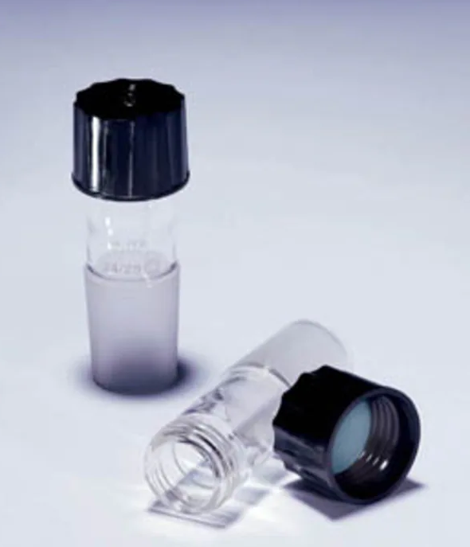
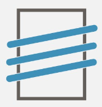
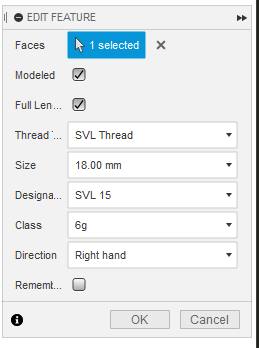

# SVL Thread Configuration for Fusion 360

 

This repository provides a configuration file for creating SVL threads / SVL screw in Autodesk Fusion 360, specifically designed for laboratory glassware applications. The SVL (Standardized Versatile Laboratory) thread is commonly used in glassware connections to provide a secure and standardized fit between different pieces of laboratory equipment.

## Table of Contents

- [About SVL](#about-svl)
- [Installation](#installation)
- [Usage](#usage)
- [Contributing](#contributing)
- [License](#license)
- [Disclaimer](#disclaimer)

## About SVL




The SVL thread is a standard used in laboratory glassware to ensure consistent and secure connections between components, allowing easy assembly and disassembly of experimental setups. This configuration was meticulously created based on precise measurements taken directly from a physical SVL threaded piece to ensure compatibility and accuracy.

## Installation

To use this SVL thread configuration in Autodesk Fusion 360, follow these steps:

1. Download the configuration file from this repository.
2. Move the configuration to the right directory:

**On Windows:**

```
%localappdata%\Autodesk\webdeploy\Production\<version ID>\Fusion\Server\Fusion\Configuration\ThreadData
```

**On Mac OS:**

```
Macintosh HD> Users> [Username] > Library > Application Support > Autodesk > Webdeploy > production > [Version specific ID] > Then right click on "Autodesk Fusion 360" and choose Show Package Contents > Contents > Libraries > Applications > Fusion > Fusion > Server > Fusion > Configuration >ThreadData*
```

3. Alternatively, you can use **[ThreadKeeper](https://github.com/thomasa88/ThreadKeeper)**, a popular module for Fusion 360 that simplifies the process of managing and importing thread configurations.

[Creating custom threads and thread standards in Fusion](https://www.autodesk.com/support/technical/article/caas/sfdcarticles/sfdcarticles/Custom-Threads-in-Fusion-360.html)

> Note: Profiles will need to be reinstalled after every Fusion 360 update if you don't use [ThreadKeeper](https://github.com/thomasa88/ThreadKeeper) plugin.

## Usage




Once installed, the SVL thread configuration will be available when creating a thread feature in Fusion 360.

> Note: It has been tested only with 3D printing using an FDM printer, and results may vary depending on printer settings, material, and calibration.

## Contributions

Corrections, suggestions, and additions are highly welcomed! If you have modifications or further improvements, please feel free to submit a pull request or open an issue. This project aims to provide a reliable tool for laboratory enthusiasts and professionals, and your input can help make it even better.

## License

This project is licensed under the Apache License 2.0.
Please see the [`LICENSE`](LICENSE) file for more details.

## Disclaimer

This thread configuration has been tested only on 3D-printed parts using an FDM printer. Use it in other applications at your own discretion. Real-world usage and compatibility with original glassware components should be verified carefully.

---

Thank you for using and contributing to this configuration. Together, we can make laboratory experimentation more accessible and effective for everyone.
